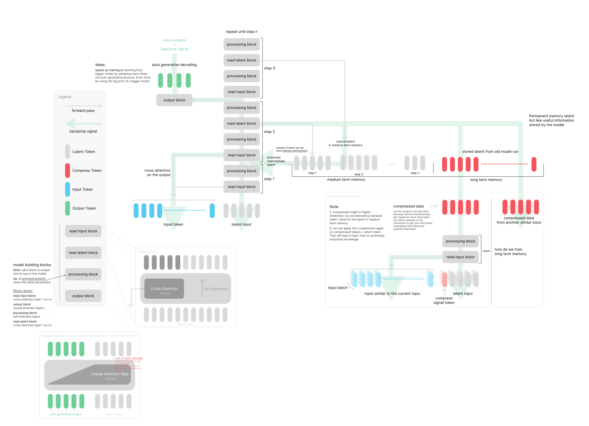

# Thinker
The trained computer

This project explores "Language Modeling as Compression" and reasoning via latent transformers.

## Statut des chantiers (2026-09-13)

| Chantier | Statut | Où |
|---|---|---|
| **Indexed Attention / `Thinker`** | 🟢 **Chantier principal actif** — l'architecture de la thèse | `core/indexed_memory.py`, `core/indexed_thinker_model.py`, `learn/indexed_attention/`, spec `dev_notes/indexed_attention_spec.md`, plan `dev_notes/indexed_attention_experiment_plan.md` |
| **Distillation** | 🟢 Actif, en parallèle **volontairement** : produit une baseline sur architecture standard et fait acquérir l'expérience de la distillation (Teacher, KD Top-K, muP, checkpoint/resume) avant de l'appliquer au `Thinker` (plan Phase 4) | `learn/distill/` |
| **LLM as Data Compressor** | 🔴 **ARRÊTÉ** — travaux gelés, conservés pour l'historique. Ne pas y consacrer de ressources. La section ci-dessous décrit l'état au moment de l'arrêt | `core/compressor/`, `docs/compression/`, `notebooks/` |

**Chantier toy model (opérations de calcul simple)** : garé depuis mars, repris le 2026-09-13 — la question qu'il devait trancher (« le loop reasoning avec mémoire moyen terme construite à la volée fonctionne-t-il ? ») n'a jamais été testée. Constat et protocole : `dev_notes/toy_model_memory_experiments.md`.

**Point d'entrée pour toute session de travail sur l'architecture** : `dev_notes/indexed_attention_experiment_plan.md`, section « ⚠️ PRIORITÉ ABSOLUE — révision post-contre-expertise », qui liste ce qui est invalidé, ce qui est corrigé dans le code, et l'ordre d'exécution des re-runs.

## 🚀 LLM as Data Compressor (chantier arrêté — historique)
We have implemented a framework to use pretrained LLMs (GPT-2, SmolLM, Qwen) as general-purpose compressors.
- **Hierarchical Latent Optimization:** Automatically find the minimal prompt length needed for a target text.
- **Multi-Model Scaling Study:** Systematic analysis of how model size (135M to 1.5B+) impacts compression efficiency.
- **Rank-Based Error Correction:** quantify additional information needed to reach 100% accuracy using Shannon entropy of token ranks.
- **Visual Analytics:** Enhanced plotting of scaling curves and rank distributions to analyze the "Quantization Gap".

Checkout :
- [toy_model.py](core/toy_model.py)
- [LLM as Data Compressor Core](core/compressor/)
- [Scaling Study Notebook](notebooks/LLM_Compressor_Scaling.ipynb) (Colab-ready with T4 GPU)
- [Analyse détaillée des expériences](dev_notes/analysis_first_experiments.md)

### Détails du chantier compression (historique, arrêté)
This sub-project explores using LLMs to compress data by finding optimal prompts.
- **Goal:** Achieve high compression ratios by storing only a short prompt and correction ranks.
- **Experiment Storage:** 
    - Detailed artifacts (logits, ranks, prompts) are stored in `logs/`.
    - Experiment summaries and technical notes are documented in [docs/compression/](docs/compression/).
    - When running on Colab, use `scripts/sync_results.py` to package results, then unzip them at the project root to synchronize.
- **Key Findings (Apr 2026):**
    - **Model Scaling:** Decompressing ability scales clearly with model size. `Qwen2.5-3B` reached **~66%** Top-1 accuracy on 800-token sequences, compared to **~60%** for `SmolLM-135M`.
    - **Compression Efficiency:** We achieved **~3.6x** compression on long sequences (800 tokens) even with high overhead 100-token prompts.
    - **Quantization Gap:** Even with deep optimization (Loss < 0.00001), discrete accuracy remains significantly lower than soft accuracy, confirming the "Translation Loss".
    - **Technical Deep Dives:** See [Explanation of Convergence](docs/compression/explanation_convergence.md) and [Analysis of First Experiments](docs/compression/analysis_first_experiments.md).
- **Environment:** Use the `thinker` conda environment.
- **Usage:**
  ```bash
  export PYTHONPATH=$PYTHONPATH:.
  conda run -n thinker python scripts/compress_demo.py --text "Your text here" --n_prompt 5 --n_steps 100
  ```
- **Experiment Skill:** A project-specific skill `compressor-experiment` is available to automate and log experiments. Use it to run batch trials or systematic tests.
- **Dependencies:** `transformers`, `accelerate`, `torch` (CPU version recommended for local development).

_Fin de la section historique du chantier compression._

Based on the observed result we could re-use the same approach on Language Modeling Task following the [original ideas](https://www.figma.com/file/MNe376umkTm5iCpg9kSmcq/thinking-transformer?type=design&node-id=328-196&mode=design).

**About the model**  
The model is a cross-attention latent-based transformer (like Perceiver):
1. layer weight sharing to allow reuseable compute block
2. hidden latent vector as information passing
3. cross attention on input
4. cross attention on past latent (wider information passing)

[here's a visual](https://www.figma.com/file/MNe376umkTm5iCpg9kSmcq/thinking-transformer?type=design&node-id=328-196&mode=design)



[here's a draft of the initial idea](dev_notes/ideas/ideas-draft.md)

## Project Structure

```text
thinker/
├── core/                       # 🧠 Core architecture and tools
│   ├── models.py               # Main model configurations
│   ├── toy_model.py            # Primary ToyThinker model
│   ├── layers.py               # Basic model layers (SwiGLU, RMSNorm, FlexDecoderLayer, RoPE)
│   └── utils.py                # Core utilities (e.g. CfgNode)
├── data/                       # 🗃️ Datasets and curriculum logic
│   └── numbers.py              # Generative/Curriculum datasets
├── scripts/                    # 🚀 Entrypoint scripts for execution
│   ├── train.py                # Setup for automated (15 min budget) autoresearch training
│   ├── th1nker_runner.py       # Standard runner
│   ├── run_lightning.py        # Lightning-based runner
│   ├── generate_embeddings.py  # Utility scripts
│   └── visualize.py            # Log visualization
├── notebooks/                  # 📓 Rapid prototyping and Colab entrypoint
│   └── Th1nker_runner.ipynb
├── dev_notes/                  # 📝 Development notes, DB structures, past experiments
│   ├── ideas/                  
│   └── experiment.log.md
├── docs/                       # 📚 Documentation
│   └── ToDo.md
├── inspirations/               # 💡 External references (Autoresearch, AdderBoard)
└── program.md                  # 🤖 System instructions for automated research agents
```

Similar ideas:
1. Looped Transformers - [paper](https://arxiv.org/pdf/2311.12424) - [x_post](https://twitter.com/DimitrisPapail/status/1747302035077378110) - [code](https://github.com/Leiay/looped_transformer/tree/main)