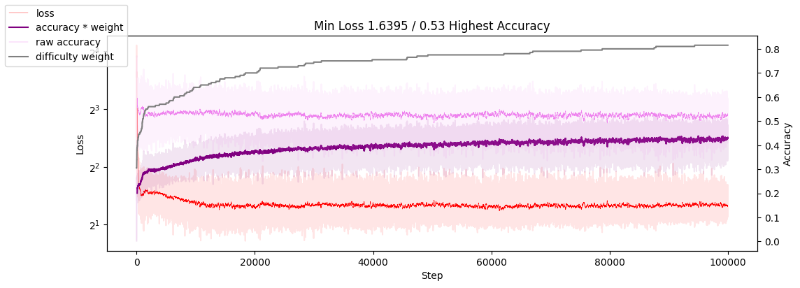

# Experiment Log

## 05 Dec 2023
We got the error below only on GPU, the code worked well on CPU!
```RuntimeError: one of the variables needed for gradient computation has been modified by an inplace operation: [torch.cuda.FloatTensor [27, 4, 606, 8]], which is output 0 of AsStridedBackward0, is at version 19; expected version 18 instead. Hint: the backtrace further above shows the operation that failed to compute its gradient. The variable in question was changed in there or anywhere later. Good luck!```

Because of:
`self.k_cache[:, begin_insert_idx:end_insert_idx] = k`

Fixed it in commit `f96161d`, which should be improve for code cleanes and performance

Should improve device assignement, now I have to use: `with torch.device(device):`

## 06 Dec 2023

Oups The model don't learn!

Make the problem simpler:
- task : copy input sequence of 1010 to output 
- run model for 1 step
- use only crossentropy loss

The model learned:
- to pic the right embedding 0, 1
- identify the end of the sequence
- for some sample make perfect copy

Observation:
- the task require more compute than expected, the model observed 1.5e samples = 30.000 batchs * 512 sample/batch * lr = 0.001 per batch 
- at the beginning the loss go down quite easily, after it's constant loss for long time `5e6 samples` then start reducing quickly during that phase the accuracy also improve. My interpretation is that the solution we're looking is rare in the solution space, and difficult to be found via the loss landscape. but ounce around the `exploring stop` and `improvement start` until it get stuck again.
- Now the model learn the task some sample a perfectly predicted but vaerage accuray is 0.5 works better but I didn't manage to 

## 07 Dec 2023

Looking for solution to make the model reach 100% accuracy on copy task, but the compute seem too long.

I move for 0,1 sequence of number to 0,1,2 .., 10 sequence wich with my with give stringe signale to model during trining since the're not just 2 options


## 08 Dec 2023

I suspect something wrong with my model implem 

## 18 Dec 2023
I spent a lot of time debugging finally the issue was the model the batch and the sequence lenght was permutted in transformer pytiorch installation that's why my model wasn't leaning anything.
After issue was fixed the model learn quite quickly copy task, with flip, rolled number
Addin 2 step incresea significaly the performance on learning rolled number

After I reagange the model to make it behave like thinker (memeory+step)
I manage to reach 97 accuracy on addition of number on base 16 (max number was 1000)

from a previous training I observe that changing didn't affect performance on this task so I used fix step=1 and latent=4
With batchsize of 4096, learning_rate=0.02, 

I had to implement restart with best model when loss drop and gradient clipping, especially gradient clipping is very effective

I was worrying about the data loading timing, but it seem to be good
```
0.000336 second for data loading
0.011631 second for forward+loss
0.081530 second for backward+remaining
```

I manage to have 95% GPU utilisation even with 2.6Gb usage on Colab T4

I manage to reach 97accuracy for addition of base 16 number between 0-1000 (base10) with bacth size1024 and lr 0.005


# 19 Dec
I manage to run 3000 iteration in 2min with 95 accuracy on addition task but didn't reach 100% accuracy  

I observe it took me a lot of time to find the hyperameter and training setup for fast training  

To go faster I can:  
1. run many experiment in the backgroud while doing other stuff -> move to pytorch lighting will help  
2. find simpler problem eg. make copy just by lookig at memory

Project Update:
1. Moved to Pytorch Lighting
2. Avoid un-necessary computation by making optionnal the self attention in nn.TransformerDecoder
3. Update the CopyDataset for larger batch and more task
4. Tried TPU without success du to error on sub libray `import _XLA` 

Some ideas:
For faster training improve the loss, by make it lower for likely output regarding the problem:
1. for LLM task make, compare output distribution unregarding token location eg:
    1. global embedding average, loss = avg(output) - avg(target)
    2. loss on token neigborh
    3. compare all output to all target embedding :
        1. cluster targets embedding with in n centroid with knn, n==output embedding
        2. push the closest each output to move closer to his closest embedding, step after step
2. for number base task, we can make the loss to be condition on the sequence (or just use causal decoding)

# 20 Dec

model with hdim=16 and 9k parameters seam to perform the addition as well, just need more iteration to converge, number of latent and step seam not affect much the performance even the training are the all same while changing latent and step


to go faster I should test the model with simpler task, such as copy and thier variants

```python
model_cfg = CfgNode(
    vocab_size = 31+1, n_probe = 1,
    max_latent=64, max_input_len=48, output_len=40,
    d_model=16, nhead=8, d_hid=16*4, nlayers=1, dropout=0
)
data_cfg = CfgNode(low=0, high=16, seq_len=20, batch=1, task=None)
run_cfg = CfgNode(max_iter=4_000, learning_rate=0.01, batch = 1024)
exp_cfg = CfgNode(
    n_latent = range(4, 8+1), # hyper parameters grid search
    n_step = range(1, 4+1),
)
```
the result below


Observation, the model with higher capacity step=4 perform consitenly bad, probably it need more iterations to converge

# 21 Dec

I design a basic currilum learning and it make the copy task much easier to learn, the model reach 100accuracy with that eproach but plateau 60accuracy without it.

How I made the currilum, I vary the sequence lenght in the dataset following an uniform distrubtion, so that the model can easily learn from the short sequence and progressively learn how the longer one's


Regarding this significan improvement I made a better currilum: by make a dynamic sampling the dataset distrution. With a risk of making the problem non-stationnary, but I think even if is non stationary the loss landscape should be easier the navigate during optimisation. 

# 22 Dec
I implemented a training process that progressivelly increase the difficulty level of the task, wich seem to give better result


training setup
```
task:
    name = curriculum_copy
    sequence_len = 20
    vocab_size = 16
model:
    hdim = 16
    nhead = 4
    d_hid = 16*4  # feed forward project dimension
    prossing_layer = 1 
    ouput_decoding layer = 1 
running:
    latent = 4
    step = 6
training:
    batch = 512
    learning rate = 0.05
    check_point_auto_reset = 0
```

I observe a plateau,

Hypothesis:
1. the learning signal is weak since there are only ~3tokens failling at the end of the training, the level of success is too to created a good training signal we can observe the loss drop in the figure up here ☝
2. the learned positionnal encoding to be stuck for some last element to learn

An solution to the last hypothesis could a variable position encoding "kinda denoising position"
ideas: I could randomized postional encoding
    eg.1 vary the resolution and the offset of frequency base positional encoder  
    eg.2 sample while keeping order of learned postionnal embedding   


When I increased the seqlen I observe that the model manage to go over the previous performance plateau. It took around 10k iteration to reach %50 wich is approximate to 20seqlen prediction and after 30k step the model reach 30seqlen copy before have a peak loss (I should implement a better model checkpoint reload!)  


At 50seqlen I have un error realted to CUDA even if I only use 0.3/15 GB of GPU MEM! 

So I increased the vocabulary size from 16 to 32, even with that the model dont seem to be at capacity


hypothesis for plateau:
learning rate 0.01 too high, might explain the noisy loss curve even with 512 batch size

conclusion: having a plateau doesn't mean that the model is at capacity
I still suspect the position encore to be cause 

## varying position embedding
the model stuck at .2 accuracy with `varying position embedding`


Sometimes you just have to train longer and/or make the task easier
after some iteration, I made it WORK!!

key_parameters
```
task:
    name = curriculum_copy
    sequence_len = 5 (and 10 in the 2nd experiment)
    vocab_size = 16
model:
    max_input_len  = 5 *4, # x4 space for varying position embedding
    max_output_len = 5 *4, # x4 space for varying position embedding

    hdim  = 32
    nhead = 8
    prossing_layer = 1 
    ouput_decoding layer = 2 # big change
```
_Note: I enable self attention in output TransformerDecoder, it was disable before since we where querying the model directly with the output query_


for the second experiment I changed
```
sequence_len = 10
max_input_len  = 10 *3,
max_output_len = 10 *3,
```


# Jan 6

No experiment has been conducted recently, but I have implemented a full auto regressive flow (i.e., [Perceiver AR](https://arxiv.org/abs/2202.07765)). This ensures that the model will have a history from the beginning to the end of the multi-step forward pass, providing a stronger signal for easier optimization.
- With an appropriate mask, this will ensure there's no data leakage from future tokens given as input.
- Since there's more 'capacity' in the latent flow than in a single token flow, I expect the optimization to transfer the required computation to the latent flow.
- The capabilities learned in the latent flow could easily be transferred to the standard output, which has a weaker signal compared to the full flow autoregressive process.
:-) for longuer context we can use mistral layer to layer window shift 

I should implement a planned flow runner, that will help to implement different strategy or even random strategy

strategy: do all the time  
step | read_input | mem_lookup | mem_write  | output  
-----|------------|------------|------------|-------  
  1  |     1      |      1     |      1     |   1     
  2  |     1      |      1     |      1     |   1     
  3  |     1      |      1     |      1     |   1     

strategy: read ounce at the begging, output at the end with mem  
step | read_input | mem_lookup | mem_write  | output  
-----|------------|------------|------------|-------  
  1  |     1      |      0     |      1     |   0     
  2  |     0      |      1     |      1     |   0     
  3  |     0      |      1     |      1     |   0     
  4  |     0      |      1     |      0     |   1     


list of attributes:
- read_input
- mem_lookup
- mem_write
- static_mem_lookup
- output

_This is not yet implemented!_

# March 8
Empty brain!  
Should I implement, language model distillation task? as initially planned  
or keep going with toy task and model?

# Sept 18
Ca marche!


```
    learning_rate=0.001,
    batch = 128,
    n_latent = [range(4,16+1,2)], # max latent -> 16
    n_step = [range(4,12+1)],     # max step   -> 12
```

At epoch 30k I paused the training, and incresed the compute capacity and this happened, the model generalized immediatly for all compute capacity


Changelog when increased compute capacity
```
    learning_rate=0.01,
    batch = 1024,
    n_latent = [range(4,24+1,2)], # max latent -> 24
    n_step = [range(4,16+1)],     # max step   -> 16
```

hypothesis pertubation help, shake the model and might lead to convergence since the optimization is on going

### add pertubation in latent
```
# latent = self.embd_latent(pos[:,:n_latent]) # B, L, H
latent = self.embd_latent(pos[:,0:1]) + torch.normal(0, .1, size=(B, L, H)) # B, L, H
```

# Sept 19
With lower training iteration, we observe this, the same partern with lower accuracy




